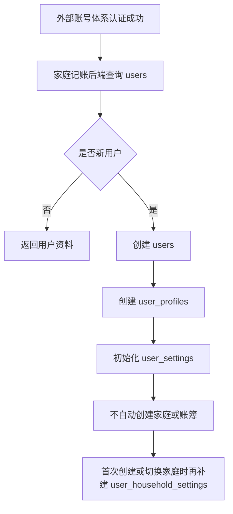
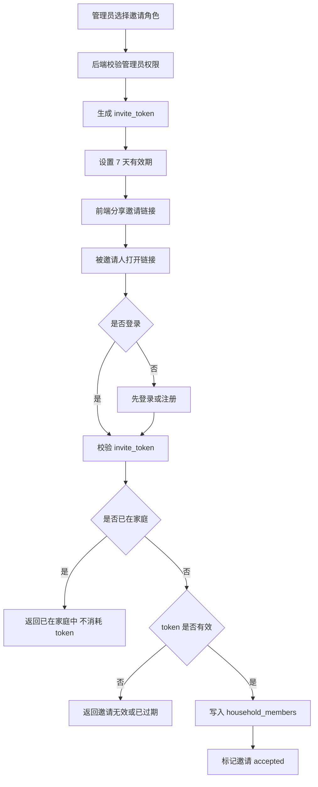
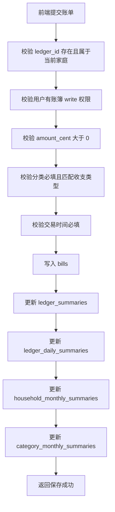
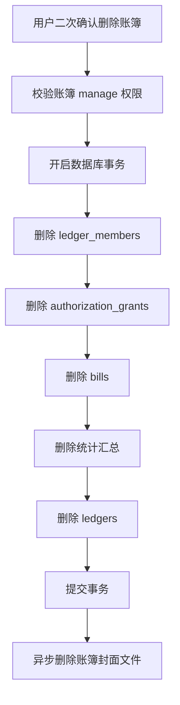
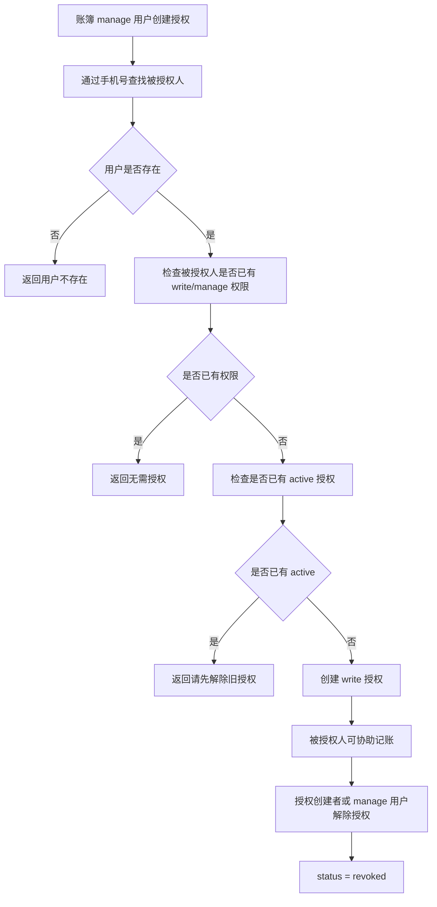
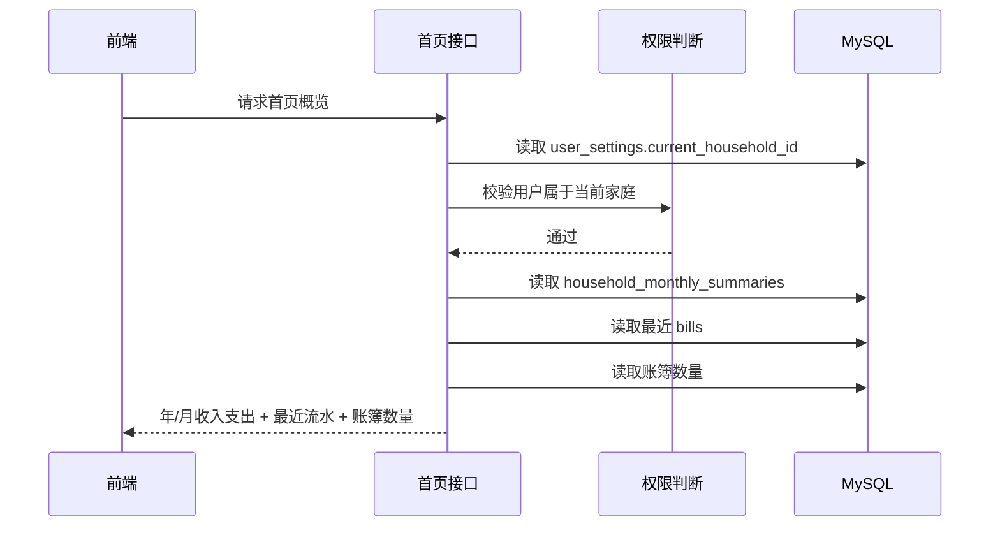
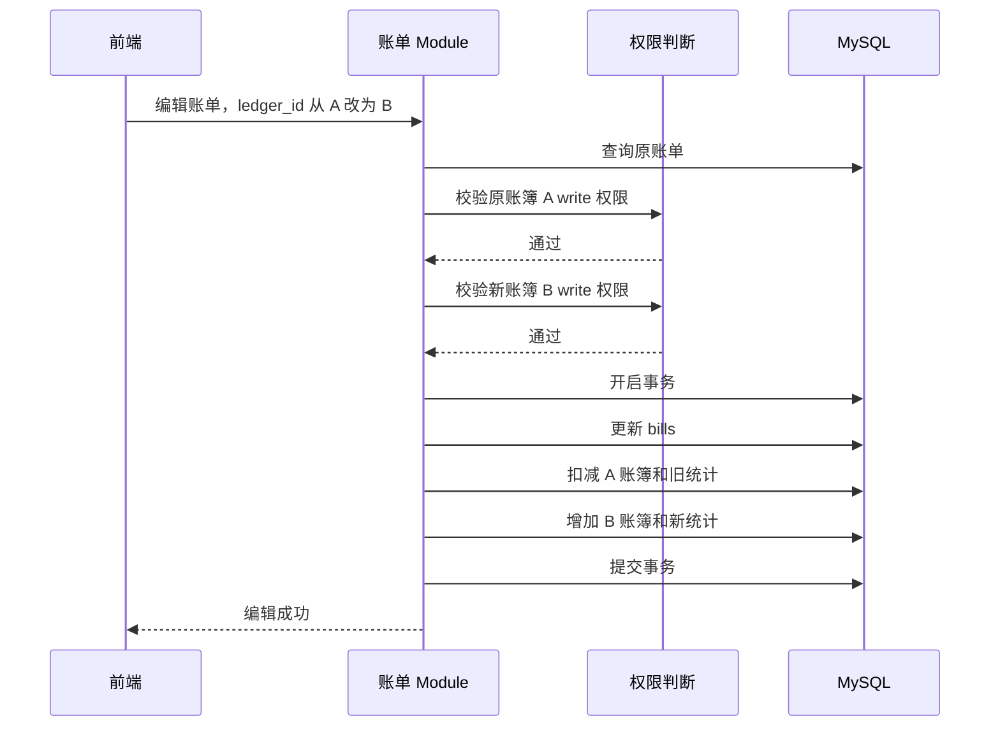
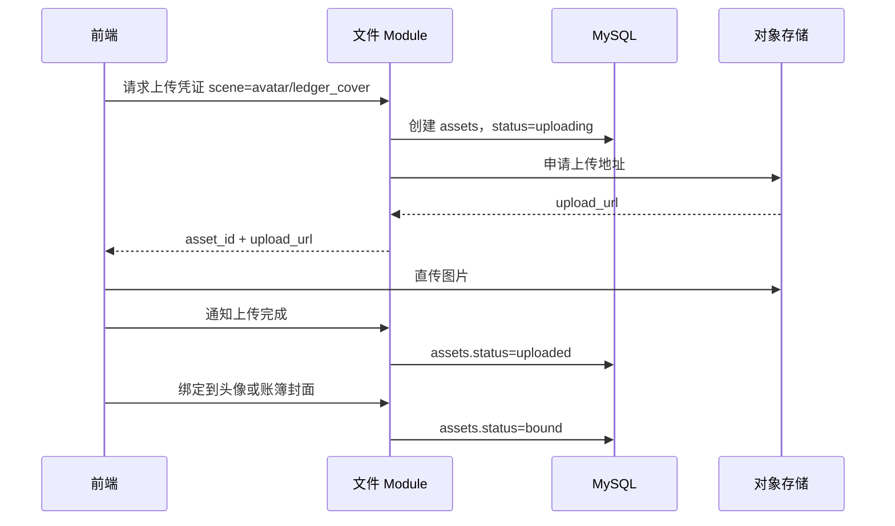

# 家庭记账应用 V1.0 后端技术方案

> 本文根据 PRD 中的 UI 交互倒推后端设计。目标是让前端、后端、测试都能看懂：每个页面需要后端做什么、数据怎么存、权限怎么判断、核心流程怎么走。

## 1. 方案结论

V1.0 后端先覆盖 7 个核心 Module：

| Module    | 负责什么                       |
| --------- | -------------------------- |
| 用户 Module | 用户资料、头像、昵称、性别、生日、当前家庭      |
| 家庭 Module | 家庭列表、家庭详情、成员、角色、邀请、退出、删除   |
| 账簿 Module | 创建账簿、编辑账簿、共享账簿、删除账簿、账簿汇总   |
| 账单 Module | 记一笔、编辑账单、删除账单、账单列表、筛选、游标分页 |
| 统计 Module | 首页统计、账簿统计、统计图表             |
| 授权 Module | 创建授权、我的授权、我协助的、解除授权、授权过期   |
| 文件 Module | 头像上传、账簿封面上传、无主文件清理         |

V1.0 不做产品埋点 Module。PRD 中的 `homepage_add_bill_click`、`ledger_create_submit` 等产品埋点不进入本后端方案。

但保留后端关键操作日志 `operation_logs`，用于排查和审计，不提供用户侧查看入口。

## 2. 按 UI 交互理解后端能力

| UI 页面/操作 | 后端要做什么                       | 涉及数据                 |
| -------- | ---------------------------- | -------------------- |
| 首页加载     | 根据当前家庭返回年/月收入支出、最近账单、账簿数量    | 家庭、账簿、账单、家庭月汇总       |
| 切换家庭     | 校验用户属于目标家庭，保存当前选中家庭          | 用户设置、家庭成员            |
| 点击记一笔    | 校验账簿、金额、分类、权限，保存账单并更新统计      | 账单、账簿汇总、家庭月汇总、分类月汇总  |
| 新建账簿     | 保存账簿名、封面、共享状态、共享成员           | 账簿、账簿成员、文件           |
| 家庭详情     | 返回家庭成员、成员角色、共享账簿             | 家庭、家庭成员、账簿           |
| 邀请成员     | 生成 7 天有效、单次使用的邀请链接           | 家庭邀请、家庭成员            |
| 修改成员角色   | 校验管理员权限，更新成员角色               | 家庭成员、操作日志            |
| 删除家庭     | 管理员二次确认后物理删除家庭相关数据           | 家庭、成员、邀请、账簿、账单、授权、汇总 |
| 账簿主页     | 返回账簿基础信息、收录笔数、总收入、总支出、最后记录日期 | 账簿、账簿汇总              |
| 账单列表     | 支持家庭维度、账簿维度、筛选、排序、游标分页       | 账单、分类、支付渠道           |
| 账单编辑     | 校验原账簿和新账簿写权限，更新账单和统计         | 账单、统计汇总              |
| 统计图表     | 支持家庭整体统计和单账簿统计，V1.0 只支持月/年   | 家庭月汇总、分类月汇总、账簿汇总     |
| 我的页面     | 返回用户资料、家庭数、账簿数、授权入口信息        | 用户资料、家庭、账簿、授权        |
| 个人资料编辑   | 每个字段单独保存，确认后立即生效             | 用户资料、文件              |
| 我的授权     | 返回我创建的授权、我协助的授权，支持解除授权       | 授权                   |

## 3. 权限模型

V1.0 采用三层权限：

```text
家庭角色权限
  ↓
账簿共享权限
  ↓
授权协助权限
```

### 3.1 家庭角色权限

家庭角色分为：

| 角色   | 能力                                  |
| ---- | ----------------------------------- |
| 管理员  | 管理家庭、邀请成员、移出成员、修改成员角色、创建/编辑/删除账簿、记账 |
| 普通成员 | 默认只读，不能修改、删除、邀请成员                   |

已确认规则：

- 家庭管理员默认拥有该家庭下所有账簿的 `manage` 权限。
- 最后一个管理员不能直接退出家庭。
- 如果家庭还有其他成员，最后一个管理员退出前必须先转让管理员。
- 如果家庭只有自己，可以解散家庭。

### 3.2 账簿共享权限

账簿成员权限：

| 权限     | 能力                               |
| ------ | -------------------------------- |
| read   | 查看账簿和账单                          |
| write  | 查看、新增账单、编辑账单、删除账单                |
| manage | write 能力 + 编辑账簿、删除账簿、管理共享成员、创建授权 |

已确认规则：

- 普通成员默认只读。
- 普通成员可以被单独授予某个账簿的 `write` 权限。
- 账簿创建者默认拥有 `manage` 权限。
- 单人家庭不允许开启账簿共享。
- 家庭成员数大于 1 时，才允许开启账簿共享。

### 3.3 授权协助权限

授权协助用于把某个账簿的临时 `write` 权限给另一个用户。

已确认规则：

- 授权必须有有效期：`starts_at`、`ends_at`。
- V1.0 授权能力固定为 `write`，不支持 `manage`。
- 被授权人不必须是家庭成员。
- 被授权人只能访问被授权账簿，不能查看家庭详情、其他账簿、家庭成员。
- 创建授权时通过手机号查找已注册用户。
- 未注册用户暂不支持授权。
- 同一个账簿对同一个用户，同一时间只能有一条生效授权。
- 如果被授权人已经拥有该账簿 `write` 或 `manage` 权限，不允许重复创建授权。
- 只有拥有账簿 `manage` 权限的用户才能创建授权。
- 授权创建者和账簿 `manage` 权限用户都可以解除授权。
- 授权过期或解除后，保留历史记录，但不允许继续操作账簿。
- 授权过期判断以时间为准，定时任务只负责把状态补偿更新为 `expired`。

### 3.4 权限判断顺序

```text
1. 是否家庭管理员？
   是：拥有家庭内账簿 manage 权限

2. 是否账簿创建者？
   是：拥有账簿 manage 权限

3. 是否存在 ledger_members 记录？
   是：按 read / write / manage 判断

4. 是否存在有效授权？
   是：按授权能力判断，V1.0 固定为 write

5. 否则无权限
```

## 4. 删除策略

V1.0 采用物理删除，不支持恢复。

### 4.1 删除家庭

```text
删除家庭
→ 删除家庭成员
→ 删除家庭邀请
→ 删除家庭下所有账簿
→ 删除账簿成员关系
→ 删除账簿下所有账单
→ 删除相关授权记录
→ 删除统计汇总
→ 事务提交后异步删除账簿封面文件
```

规则：

- 删除家庭必须二次确认。
- 删除家庭必须校验当前用户是管理员。
- 物理删除后不允许恢复。
- 删除家庭时删除账簿封面，不删除用户头像。

### 4.2 删除账簿

规则：

- 允许删除最后一个账簿。
- 删除账簿时物理删除该账簿下所有账单。
- 删除账簿成员关系。
- 删除相关授权记录。
- 删除账簿汇总和分类汇总影响。
- 事务提交后异步删除账簿封面文件。
- 家庭下没有账簿时，首页和统计接口正常返回 0 和空列表。
- 没有账簿时不能记账，必须先创建账簿。

### 4.3 删除账单

规则：

- 单条账单删除采用物理删除。
- 不支持恢复。
- 删除前校验用户是否有该账簿 `write` 权限。
- 删除后同步更新账簿、家庭、分类统计。

## 5. 数据表设计

### 5.1 用户与设置

#### users

| 字段            | 说明           |
| ------------- | ------------ |
| id            | 用户 ID        |
| phone         | 手机号，外部账号体系返回 |
| douyin\_open\_id | 抖音标识，可为空     |
| ali\_user\_id | 支付宝标识，可为空    |
| status        | 用户状态         |
| created\_at   | 创建时间         |
| updated\_at   | 更新时间         |

#### user\_profiles

| 字段                | 说明              |
| ----------------- | --------------- |
| user\_id          | 用户 ID           |
| nickname          | 昵称，必填，最大 12 个字符 |
| avatar\_asset\_id | 当前头像文件 ID，可为空   |
| gender            | 性别，可为空          |
| birthday          | 生日，可为空          |
| created\_at       | 创建时间            |
| updated\_at       | 更新时间            |

#### user\_settings

| 字段                     | 说明     |
| ---------------------- | ------ |
| user\_id               | 用户 ID  |
| current\_household\_id | 当前选中家庭 |
| created\_at            | 创建时间   |
| updated\_at            | 更新时间   |

#### user\_household\_settings

| 字段                  | 说明         |
| ------------------- | ---------- |
| user\_id            | 用户 ID      |
| household\_id       | 家庭 ID      |
| current\_ledger\_id | 该家庭下当前选中账簿 |
| created\_at         | 创建时间       |
| updated\_at         | 更新时间       |

### 5.2 家庭

#### households

| 字段              | 说明                      |
| --------------- | ----------------------- |
| id              | 家庭 ID                   |
| name            | 家庭名称，必填，最大 20 个字符，不强制唯一 |
| owner\_user\_id | 创建者用户 ID                |
| created\_at     | 创建时间                    |
| updated\_at     | 更新时间                    |

#### household\_members

| 字段            | 说明                  |
| ------------- | ------------------- |
| id            | 成员关系 ID             |
| household\_id | 家庭 ID               |
| user\_id      | 用户 ID               |
| role          | normal / admin      |
| remark        | 家庭内备注，可为空，最大 12 个字符 |
| joined\_at    | 加入时间                |
| created\_at   | 创建时间                |
| updated\_at   | 更新时间                |

索引：

```text
UNIQUE (household_id, user_id)
INDEX (user_id)
```

#### household\_invites

| 字段                 | 说明                                      |
| ------------------ | --------------------------------------- |
| id                 | 邀请 ID                                   |
| household\_id      | 家庭 ID                                   |
| inviter\_user\_id  | 邀请人                                     |
| role               | 邀请角色：normal / admin                     |
| token\_hash        | 邀请 token 哈希                             |
| status             | pending / accepted / expired / canceled |
| expires\_at        | 过期时间，创建后 7 天                            |
| accepted\_user\_id | 接受邀请的用户                                 |
| accepted\_at       | 接受时间                                    |
| created\_at        | 创建时间                                    |
| updated\_at        | 更新时间                                    |

规则：

- 一个邀请链接只能被 1 个人使用。
- 已在家庭中的用户打开邀请链接，不消耗 token，也不修改角色。

### 5.3 账簿

#### ledgers

| 字段                 | 说明                        |
| ------------------ | ------------------------- |
| id                 | 账簿 ID                     |
| household\_id      | 家庭 ID                     |
| creator\_user\_id  | 创建者用户 ID                  |
| name               | 账簿名，必填，最大 20 个字符，同家庭不强制唯一 |
| cover\_type        | preset / custom           |
| cover\_preset\_key | 系统预设封面 key                |
| cover\_asset\_id   | 自定义封面文件 ID                |
| is\_shared         | 是否开启共享                    |
| default\_flag      | 是否默认账簿                    |
| note               | 备注，可为空                    |
| last\_recorded\_at | 最后记录日期，可为空                |
| created\_at        | 创建时间                      |
| updated\_at        | 更新时间                      |

规则：

- `cover_type = preset` 时，`cover_preset_key` 必填，`cover_asset_id` 为空。
- `cover_type = custom` 时，`cover_asset_id` 必填，`cover_preset_key` 为空。
- 自定义封面被替换后，旧封面文件自动删除。
- `default_flag` 只作为内部数据预留，不参与 V1.0 API Interface 的隐式账簿兜底选择。
- 页面优先展示用户上次显式选中的账簿；如果 `current_ledger_id = null`，由前端引导用户显式选择或创建账簿。

#### ledger\_members

| 字段          | 说明                    |
| ----------- | --------------------- |
| id          | 账簿成员关系 ID             |
| ledger\_id  | 账簿 ID                 |
| user\_id    | 用户 ID                 |
| permission  | read / write / manage |
| created\_at | 创建时间                  |
| updated\_at | 更新时间                  |

索引：

```text
UNIQUE (ledger_id, user_id)
INDEX (user_id)
```

#### ledger\_summaries

| 字段                   | 说明      |
| -------------------- | ------- |
| ledger\_id           | 账簿 ID   |
| total\_income\_cent  | 总收入，单位分 |
| total\_expense\_cent | 总支出，单位分 |
| bill\_count          | 收录笔数    |
| created\_at          | 创建时间    |
| updated\_at          | 更新时间    |

说明：

- 账簿总收入、总支出、收录笔数放在 `ledger_summaries`。
- `ledgers` 只保留账簿基础信息和 `last_recorded_at`。

### 5.4 账单

#### bills

| 字段                          | 说明                               |
| --------------------------- | -------------------------------- |
| id                          | 账单 ID                            |
| household\_id               | 家庭 ID                            |
| ledger\_id                  | 账簿 ID                            |
| creator\_user\_id           | 创建人用户 ID，创建后不可修改                 |
| creator\_nickname\_snapshot | 创建人昵称快照，创建后不可修改                  |
| creator\_avatar\_snapshot   | 创建人头像快照，创建后不可修改                  |
| bill\_type                  | income / expense                 |
| category\_id                | 分类 ID，必填                         |
| channel\_id                 | 支付渠道 ID，可为空                      |
| amount\_cent                | 金额，单位分，必须大于 0                    |
| occurred\_at                | 交易时间，必填                          |
| remark                      | 备注，可为空，最大 200 个字符                |
| source\_type                | manual / ai，V1.0 固定 manual，预留 ai |
| source\_payload\_json       | AI 原始结果，V1.0 为空                  |
| created\_at                 | 创建时间                             |
| updated\_at                 | 更新时间                             |

索引：

```text
INDEX (ledger_id, occurred_at, id)
INDEX (household_id, occurred_at, id)
INDEX (ledger_id, amount_cent, id)
INDEX (household_id, amount_cent, id)
INDEX (category_id)
```

规则：

- 金额只支持人民币。
- 金额统一按“分”存储，`12.35 元 = 1235`。
- `amount_cent` 永远存正整数，收入/支出由 `bill_type` 区分。
- `category_id` 必填，且必须匹配 `bill_type`。
- `channel_id` 选填，如果填写必须是系统预设渠道。
- `occurred_at` 必填，前端默认当前时间，后端不自动补时间。
- 编辑账单时，创建人和创建人快照字段只读。
- 如果前端编辑账单时传只读字段，后端返回参数错误。
- 编辑账单时允许修改收入/支出类型，但必须校验分类匹配。
- 编辑账单时允许修改关联账簿，但必须同时校验原账簿和新账簿的 `write` 权限。

#### bill\_categories

| 字段          | 说明               |
| ----------- | ---------------- |
| id          | 分类 ID            |
| name        | 分类名称             |
| type        | income / expense |
| icon\_key   | 图标 key           |
| color       | 色值               |
| sort\_order | 排序               |
| enabled     | 是否启用             |

规则：

- V1.0 只支持系统预设分类。
- 用户不能新增、编辑、删除分类。

#### payment\_channels

| 字段          | 说明     |
| ----------- | ------ |
| id          | 渠道 ID  |
| name        | 渠道名称   |
| icon\_key   | 图标 key |
| sort\_order | 排序     |
| enabled     | 是否启用   |

规则：

- V1.0 只支持系统预设支付渠道。
- 用户不能新增、编辑、删除渠道。

### 5.5 统计

统计采用提前汇总，并在账单变化时同步更新。

#### ledger\_daily\_summaries

| 字段            | 说明    |
| ------------- | ----- |
| ledger\_id    | 账簿 ID |
| stat\_date    | 日期    |
| income\_cent  | 当日收入  |
| expense\_cent | 当日支出  |
| bill\_count   | 当日账单数 |

#### household\_monthly\_summaries

| 字段            | 说明            |
| ------------- | ------------- |
| household\_id | 家庭 ID         |
| stat\_month   | 月份，例如 2026-07 |
| income\_cent  | 月收入           |
| expense\_cent | 月支出           |
| bill\_count   | 月账单数          |

#### category\_monthly\_summaries

| 字段            | 说明               |
| ------------- | ---------------- |
| household\_id | 家庭 ID            |
| ledger\_id    | 账簿 ID，可为空        |
| category\_id  | 分类 ID            |
| stat\_month   | 月份               |
| bill\_type    | income / expense |
| amount\_cent  | 分类金额             |
| bill\_count   | 分类账单数            |

说明：

- 首页月收入/月支出读 `household_monthly_summaries` 当前月。
- 首页年收入/年支出汇总当前年份 12 个月。
- 统计图表 V1.0 只支持按月和按年。
- 统计图表同时支持家庭整体统计和单账簿统计。

### 5.6 授权

#### authorization\_grants

| 字段                    | 说明                         |
| --------------------- | -------------------------- |
| id                    | 授权 ID                      |
| ledger\_id            | 授权账簿                       |
| grantor\_user\_id     | 授权创建人                      |
| grantee\_user\_id     | 被授权人                       |
| permission            | V1.0 固定 write              |
| starts\_at            | 授权开始时间                     |
| ends\_at              | 授权结束时间                     |
| status                | active / expired / revoked |
| revoked\_at           | 解除时间                       |
| revoked\_by\_user\_id | 解除人                        |
| created\_at           | 创建时间                       |
| updated\_at           | 更新时间                       |

索引：

```text
INDEX (grantor_user_id, status)
INDEX (grantee_user_id, status)
INDEX (ledger_id, grantee_user_id, status)
```

### 5.7 文件

#### assets

| 字段              | 说明                           |
| --------------- | ---------------------------- |
| id              | 文件 ID                        |
| owner\_user\_id | 拥有者                          |
| scene           | avatar / ledger\_cover       |
| object\_key     | 对象存储 key                     |
| url             | 可访问地址                        |
| mime\_type      | image/jpeg / image/png       |
| size\_bytes     | 文件大小                         |
| status          | uploading / uploaded / bound |
| created\_at     | 创建时间                         |
| updated\_at     | 更新时间                         |

规则：

- 头像和账簿封面采用“后端发上传凭证，前端直传对象存储”。
- 头像和账簿封面只支持 JPG/PNG。
- 文件大小不超过 5MB。
- 未完成或未绑定的上传文件，超过 24 小时自动清理。
- 用户替换头像后删除旧头像文件。
- 历史账单头像快照如果不可访问，前端展示默认头像。

### 5.8 操作日志

#### operation\_logs

| 字段                 | 说明                                                |
| ------------------ | ------------------------------------------------- |
| id                 | 日志 ID                                             |
| operator\_user\_id | 操作人                                               |
| action             | 操作类型                                              |
| target\_type       | household / ledger / bill / authorization / asset |
| target\_id         | 目标 ID                                             |
| detail\_json       | 操作详情                                              |
| created\_at        | 创建时间                                              |

记录范围：

- 删除家庭
- 删除账簿
- 删除账单
- 修改成员角色
- 移出成员
- 创建授权
- 解除授权
- 替换账簿封面

V1.0 不提供用户侧查询接口。

## 6. 核心流程图

### 6.1 新用户初始化



### 6.2 家庭邀请



### 6.3 记一笔



### 6.4 删除账簿



### 6.5 授权创建与解除



## 7. 核心时序图

### 7.1 首页加载



### 7.2 账单编辑并迁移账簿



### 7.3 文件上传



## 8. 账单列表与筛选

### 8.1 查询维度

账单列表同时支持家庭维度和账簿维度。

```text
全部账单页：
  按 household_id 查询当前家庭下，用户有权限访问的所有账簿账单

账簿明细页：
  按 household_id + ledger_id 查询指定账簿账单
```

### 8.2 筛选条件

支持：

- 收支类型：收入 / 支出 / 全部
- 账单分类：系统预设分类
- 支付渠道：系统预设渠道
- 金额范围：包含最低值和最高值
- 月份
- 账簿

金额范围规则：

```text
min_amount_cent <= amount_cent <= max_amount_cent
```

### 8.3 排序

支持：

```text
time_desc    交易时间倒序，默认
time_asc     交易时间正序
amount_desc  金额倒序
amount_asc   金额正序
```

默认排序：

```text
occurred_at DESC, id DESC
```

### 8.4 游标分页

V1.0 账单列表采用游标分页。

首次加载：

```text
GET /bills?household_id=xxx&limit=20
```

加载更多：

```text
GET /bills?household_id=xxx&limit=20&cursor=xxx
```

返回：

```json
{
  "error": 0,
  "message": "success",
  "data": {
    "items": [],
    "next_cursor": "xxx",
    "has_more": true
  }
}
```

没有更多：

```json
{
  "error": 0,
  "message": "success",
  "data": {
    "items": [],
    "next_cursor": null,
    "has_more": false
  }
}
```

## 9. 统计规则

统计采用提前汇总，并在账单变化时同步更新。

新增账单：

```text
写入 bills
增加对应账簿、家庭、分类统计
更新 ledgers.last_recorded_at
```

编辑账单：

```text
先扣掉旧账单影响
再加上新账单影响
如果交易时间或账簿变化，重算受影响账簿 last_recorded_at
```

删除账单：

```text
物理删除 bills
扣掉该账单对统计的影响
如果删除的是最后一条账单，重算 last_recorded_at
```

首页没有账簿时：

```text
年收入 = 0
年支出 = 0
月收入 = 0
月支出 = 0
最近流水 = []
账簿列表 = []
统计图表数据 = []
```

## 10. 个人资料规则

个人资料每个字段独立保存，确认后立即生效。

推荐接口：

```text
PATCH /user/profile/avatar
PATCH /user/profile/nickname
PATCH /user/profile/gender
PATCH /user/profile/birthday
```

规则：

- 昵称必填，最大 12 个字符。
- 头像通过文件 Module 上传和绑定。
- 修改昵称或头像后，历史账单快照不更新，只影响新账单。
- 生日必须是合法日期。
- 性别可为空。

## 11. 账号体系

V1.0 后端不自研登录，只对接外部账号体系认证结果。

账号体系负责：

```text
手机号登录
抖音登录
支付宝登录
身份认证
```

家庭记账后端负责：

```text
根据认证结果创建或查询 users
维护 user_profiles
维护 user_settings 和 user_household_settings
处理家庭、账簿、账单、权限、授权
```

V1.0 暂不支持用户自助注销账号。

## 12. 统一响应与错误码

所有后端接口统一返回：

```json
{
  "error": 0,
  "message": "success",
  "data": {}
}
```

错误返回：

```json
{
  "error": 403,
  "message": "权限不足",
  "data": null
}
```

推荐错误码：

| 错误码                               | 文案           |
| --------------------------------- | ------------ |
| PERMISSION\_DENIED                | 权限不足         |
| HOUSEHOLD\_NOT\_FOUND             | 家庭不存在        |
| LEDGER\_NOT\_FOUND                | 账簿不存在        |
| BILL\_NOT\_FOUND                  | 账单不存在        |
| NO\_LEDGER\_AVAILABLE             | 请先创建账簿       |
| INVALID\_AMOUNT                   | 金额必须大于 0     |
| CATEGORY\_TYPE\_MISMATCH          | 账单分类与收支类型不匹配 |
| READONLY\_FIELD\_SUBMITTED        | 请求包含不可修改字段   |
| INVITE\_EXPIRED                   | 邀请已过期        |
| INVITE\_USED                      | 邀请已使用        |
| AUTHORIZATION\_EXPIRED            | 授权已过期        |
| FILE\_TOO\_LARGE\_OR\_UNSUPPORTED | 格式不支持或图片过大   |

## 13. 已确认决策清单

| 决策            | 结论                               |
| ------------- | -------------------------------- |
| 是否做埋点 Module  | 不做                               |
| 权限模型          | 三层权限：家庭角色、账簿共享、授权协助              |
| 普通成员是否能记账     | 默认不能，单独授予账簿 write 后可以            |
| 授权是否有有效期      | 有                                |
| 授权过期后是否保留记录   | 保留历史记录，不允许操作                     |
| 最后一个管理员能否直接退出 | 不能，必须转让或解散                       |
| 删除家庭          | 物理删除，不允许恢复                       |
| 删除账簿          | 物理删除，并删除其下账单                     |
| 删除账单          | 物理删除，不允许恢复                       |
| 删除家庭时文件处理     | 删除账簿封面，不删除用户头像                   |
| 统计策略          | 提前汇总，账单变化时同步更新                   |
| 统计维度          | 账簿日、家庭月、分类月                      |
| 金额存储          | 人民币，按分存整数                        |
| AI/OCR        | V1.0 不接入，只预留字段                   |
| 单人家庭账簿共享      | 不允许开启                            |
| 家庭管理员权限       | 默认拥有所有家庭账簿 manage                |
| 授权能力          | V1.0 固定 write                    |
| 金额筛选边界        | 包含最低值和最高值                        |
| 账单列表排序        | 时间/金额正序倒序，默认交易时间倒序               |
| 账单列表分页        | 游标分页                             |
| 账单查询维度        | 家庭维度和账簿维度都支持                     |
| 分类和渠道         | 系统预设，不支持用户自定义                    |
| 新用户初始化        | 只初始化用户与设置，不自动创建家庭和账簿             |
| 家庭/账簿是否可改名    | 可以                               |
| 是否允许删除最后一个账簿  | 允许                               |
| 无账簿时能否记账      | 不能，必须先创建账簿                       |
| 无账簿时首页和统计     | 返回 0 和空列表                        |
| 账单分类          | 必填，且匹配收支类型                       |
| 支付渠道          | 选填                               |
| 交易时间          | 必填，前端默认当前时间，后端不自动补               |
| 个人资料保存        | 每个字段独立保存，立即生效                    |
| 文件上传          | 后端发凭证，前端直传对象存储                   |
| 文件限制          | JPG/PNG，不超过 5MB                  |
| 无主文件清理        | 超过 24 小时自动清理                     |
| 家庭邀请          | 链接邀请                             |
| 邀请有效期         | 7 天                              |
| 邀请链接使用次数      | 单次使用                             |
| 已在家庭中打开邀请     | 不消耗 token，不修改角色                  |
| 成员离开后的历史账单    | 保留，取消后续访问权限                      |
| 账单创建人展示       | 保存昵称/头像快照                        |
| 修改昵称/头像后历史快照  | 不更新                              |
| 账簿封面字段        | cover\_type 区分 preset/custom     |
| 替换账簿自定义封面     | 删除旧封面                            |
| 替换用户头像        | 删除旧头像，历史账单可降级默认头像                |
| 当前家庭          | 后端保存                             |
| 当前账簿          | 按家庭分别保存                          |
| 当前账簿允许为空      | 允许；由前端显式选择或创建后再写入                |
| 默认账簿          | 仅内部预留，不作为 API 隐式兜底               |
| 最后记录日期        | `ledgers.last_recorded_at` 冗余保存  |
| 账簿总统计         | 放在 `ledger_summaries`            |
| 首页家庭统计        | 使用 `household_monthly_summaries` |
| 统计图表范围        | V1.0 只支持按月、按年                    |
| 编辑账单修改账簿      | 允许，但校验原账簿和新账簿 write              |
| 创建人和快照字段      | 编辑时只读                            |
| 前端传只读字段       | 返回参数错误                           |
| 编辑账单修改收支类型    | 允许，但分类必须匹配                       |
| 金额            | 必须大于 0                           |
| 账单备注          | 可为空，最大 200 字符                    |
| 账簿名           | 必填，最大 20 字符，不强制唯一                |
| 家庭名           | 必填，最大 20 字符，不强制唯一                |
| 昵称            | 必填，最大 12 字符                      |
| 成员备注          | 可为空，最大 12 字符                     |
| 关于我们          | 前端静态，不接后端                        |
| 创建授权          | V1.0 支持，固定 write                 |
| 被授权人是否必须是家庭成员 | 不必须                              |
| 授权查找用户        | 通过手机号查已注册用户                      |
| 重复授权          | 同账簿同用户只能一条 active                |
| 已有账簿写权限再授权    | 不允许                              |
| 创建授权权限        | 必须拥有账簿 manage                    |
| 解除授权权限        | 授权创建者或账簿 manage 用户               |
| 授权过期任务        | 权限判断以时间为准，任务只补状态                 |
| 删除和统计更新事务     | 必须走数据库事务                         |
| 文件删除          | 事务成功后异步执行                        |
| 操作日志          | 保留后端内部操作日志                       |
| 操作日志用户可见      | V1.0 不提供用户侧查看                    |
| 登录            | 不自研，对接外部账号体系                     |
| 用户注销          | V1.0 暂不支持                        |
| 错误返回          | 统一错误码 + 错误文案                     |
| 成功返回          | 统一 code / message / data         |

## 14. Go 后端技术栈与工程架构建议

> 当前仓库采用 Go + Gin。V1.0 的落地目标是先把接口契约、事务边界、权限判断和 MySQL 持久化做清楚，不引入过重分层。

## 14.1 技术栈结论

推荐组合：

| 层 | 方案 |
| --- | --- |
| Web 框架 | Gin |
| 数据库访问 | 标准库 `database/sql` |
| 数据库 | MySQL 8 |
| 参数校验 | Handler 内显式校验 |
| 缓存/短状态 | Redis，可选 |
| 定时任务 | 平台定时任务或独立 Go command |
| 文件存储 | TOS / S3 兼容对象存储 |
| 测试 | Go `testing` + `httptest` |

说明：

- 当前业务关系清晰，MySQL 是主存储。
- V1.0 不强制引入 ORM、repository、DDD、CQRS。
- 组件初始化保持懒加载，避免单个依赖不可用时拖垮所有接口。

## 14.2 整体架构

采用单体模块化架构：

```text
客户端
  ↓
Gin Router
  ↓
Module Handler
  ↓
Module Service
  ↓
component / database.sql
  ↓
MySQL
```

V1.0 设计原则：

1. 单体服务先跑通，不拆微服务。
2. 路由集中注册，业务按模块分目录。
3. Service 直接处理权限、事务和数据库读写。
4. 所有写操作默认走数据库事务。
5. 统一响应和错误转换放在 `internal/api`。

## 14.3 推荐目录结构

当前 Go 项目建议保持如下结构：

```text
.
├── main.go
├── internal
│   ├── api
│   │   └── response.go
│   └── server
│       └── router.go
├── component
│   ├── mysql.go
│   ├── types.go
│   ├── auth_store.go
│   └── user_store.go
├── module
│   └── <module>
│       ├── router.go
│       ├── schema.go
│       └── service.go
├── service
│   ├── login.go
│   └── service.go
├── API.md
├── api-interface-v1.md
├── docker-compose.yml
└── README.md
```

目录说明：

- `main.go`：只负责创建 router 并启动服务。
- `internal/server`：集中注册所有 HTTP 路由。
- `internal/api`：统一响应结构、错误码、HTTP 状态码映射。
- `component`：MySQL 连接、登录态存储、用户存储等基础组件。
- `module/<module>`：业务模块，固定保留 `router.go`、`schema.go`、`service.go`。
- `service`：当前遗留的登录和健康检查 handler；后续可按模块逐步迁移。

V1.0 暂不增加这些目录：

- `repository`
- `domain`
- `adapter`
- `command/query`
- `event`

原因是当前复杂度主要来自接口契约和事务规则，不来自抽象层不足。

## 14.4 模块内部约定

每个业务模块固定三层：

```text
router.go  -> 注册路由、解析请求、调用 service、写响应
schema.go  -> 请求和响应结构体
service.go -> 权限判断、事务、数据库读写、组装返回
```

示例：

```text
module/bill/
  router.go   处理 POST /api/bills
  schema.go   BillCreateRequest / BillDetailResponse
  service.go  CreateBill / UpdateBill / DeleteBill / QueryBills
```

所有接口路径统一使用 `/api/` 前缀，不使用 `/api/v1/`。

## 14.5 请求与事务设计

### 14.5.1 请求流

统一处理链路：

```text
HTTP Request
→ Router 解析和校验请求
→ Service 执行业务逻辑
→ 成功时 api.Success 返回统一结构
→ 失败时返回 api.Error 并由 api.Failure 转换为统一错误响应
```

### 14.5.2 事务规则

以下操作必须走事务：

- 创建账单
- 编辑账单
- 删除账单
- 删除账簿
- 删除家庭
- 接受家庭邀请
- 创建授权
- 解除授权

建议规则：

```text
一个写接口 = 一个 service 事务边界
```

不要把事务拆散到多个 helper 里到处提交。

### 14.5.3 只读接口

以下接口保持只读，不开启显式事务：

- 家庭列表/详情查询
- 账簿列表/详情查询
- 账单列表查询
- 统计查询

## 14.6 认证、权限与配置

### 14.6.1 认证

当前仓库已实现抖音小程序静默登录：

```text
tt.login code
→ /api/auth/douyin/login
→ 抖音 jscode2session
→ 保存服务端 token
→ 初始化 users / user_profiles / user_settings
```

后续业务接口应统一从 `Authorization: Bearer <token>` 读取服务端 token，并解析出当前用户。

### 14.6.2 权限

权限判断统一放在 service 内部，按已有规则执行：

```text
家庭管理员
→ 账簿创建者
→ ledger_members
→ active authorization
→ 无权限
```

先保留几个清晰函数即可：

```text
requireHouseholdAdmin(...)
getLedgerPermission(...)
requireLedgerWrite(...)
requireLedgerManage(...)
```

### 14.6.3 配置

从环境变量读取配置：

- `MYSQL_ADDRESS`
- `MYSQL_USERNAME`
- `MYSQL_PASSWORD`
- `MYSQL_DATABASE`
- `DOUYIN_APP_ID`
- `DOUYIN_APP_SECRET`

V1.0 不需要多层配置中心。

## 14.7 文件上传设计

文件上传沿用本文前面的设计：

```text
前端请求上传凭证
→ 后端创建 assets(status=uploading)
→ 后端签发 upload_url
→ 前端直传对象存储
→ 前端通知上传完成
→ 后端更新 assets(status=uploaded/bound)
```

Go 落地建议：

- 后续新增 `module/asset` 管理上传凭证和文件绑定。
- 对象存储 SDK 只在 asset 模块内使用。
- 删除旧头像、旧封面只在事务成功后执行。

## 14.8 定时任务设计

V1.0 只需要两个任务：

| 任务 | 做什么 |
| --- | --- |
| `expire_authorizations` | 把已过期但状态还是 active 的授权补偿成 expired |
| `cleanup_assets` | 清理超过 24 小时未完成或未绑定的文件 |

执行方式：

- 开发环境：独立 Go command 或临时脚本。
- 生产环境：平台定时任务。

先不要引入消息队列。

## 14.9 测试建议

保留最小但关键的测试：

| 测试文件 | 覆盖什么 |
| --- | --- |
| `module/user/router_test.go` | 用户信息接口 token、JSON 和默认资料行为 |
| `module/bill/router_test.go` | 创建/编辑/删除账单和统计更新 |
| `module/household/router_test.go` | 接受邀请、切换家庭、删除家庭 |
| `module/ledger/router_test.go` | 创建/编辑/删除账簿、共享校验 |
| `module/authorization/router_test.go` | 创建授权、重复授权、解除授权、过期判断 |

不要一开始为每个函数都写测试，先保住关键接口契约和事务路径。

## 14.10 Go 版本的最终建议

如果继续在当前仓库实现 V1.0，推荐保持：

```text
Go 1.18+
Gin
database/sql
MySQL 8
testing + httptest
docker-compose 本地依赖
```

不追加 ORM。  
不追加 repository / DDD / CQRS。  
等真的出现复杂度，再加。
